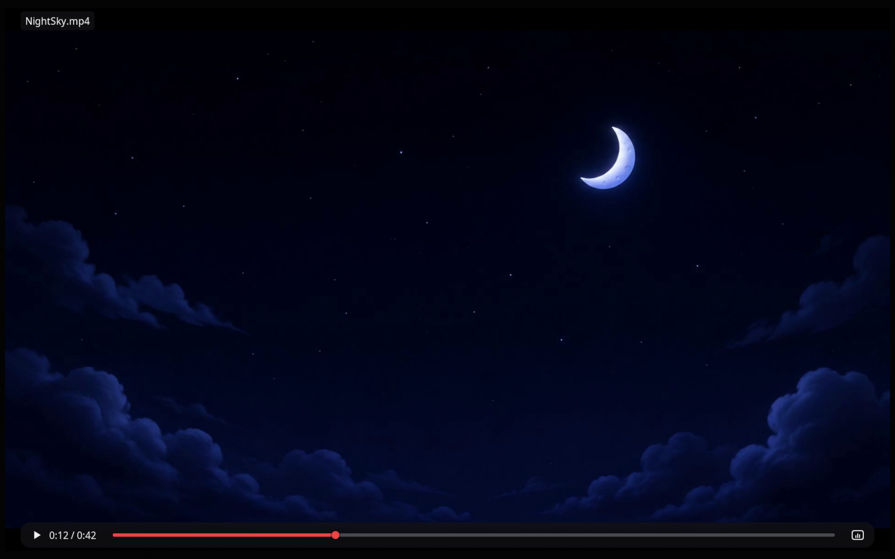

<h1 align="left">&nbsp;enzo</h1>

Terminal video player for Kitty, with native audio, subtitles, mouse controls, and resume support.

enzo plays local files and URLs directly inside the terminal.



## Features

- **Terminal-native playback** — video rendered directly inside Kitty
- **Subtitles** — detects sidecar subtitles and supports explicit `--sub-file`
- **Resume support** — restores position, audio track, and subtitle track for local seekable files
- **Mouse and keyboard controls** — pause, seek, volume, mute, track menus, and overlay controls
- **Drop target launcher** — run without a path and drop a file or URL to play

## Requirements

- Kitty
- FFmpeg libraries
- PulseAudio-compatible audio
- FreeType, HarfBuzz, and FriBidi

## Run from source

Install Rust 1.96+ and the native development headers for the libraries above, then run:

```sh
cargo run --release
```

Pass a file path or URL to start playback directly:

```sh
cargo run --release -- /path/to/video.mp4
```

For FreeBSD source builds:

```sh
pkg install rust ffmpeg pulseaudio freetype2 harfbuzz fribidi pkgconf
```

## CLI

```text
enzo [--force] [--no-resume] [--sub-file subtitle] [video-or-url]
enzo --clear-resume
```

Flags:

- `--force` — run on compatible terminals that do not advertise themselves as Kitty
- `--sub-file <path>` — load a specific SRT subtitle file
- `--no-resume` — play without reading or writing resume data
- `--clear-resume` — remove saved resume data and exit

<details>
<summary><strong>Controls</strong></summary>

- Drop a file or URL on the launcher to play it
- Space or right click pauses/resumes playback
- `9` / `0` or mouse wheel decreases/increases volume by 2%
- `m` toggles mute
- `v` toggles subtitles
- `i` shows media information; `I` pins or unpins it
- `?` toggles help; Esc closes open panels
- Left/right arrows seek by 5 seconds
- Down/up arrows seek by 60 seconds
- Click or drag the progress bar to seek
- Mouse wheel scrolls open audio/subtitle menus
- `q` quits
- `Q` quits without saving resume history

The playback overlay appears while paused, after seeking, and on mouse movement.

</details>
